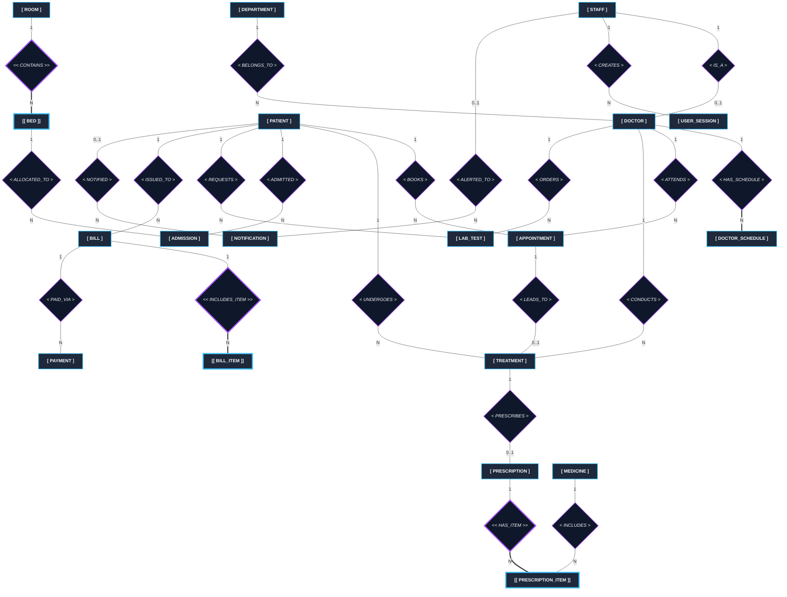

# MediCore — Entity-Relationship (ER) Diagram
**Formal Chen ER Diagram Notation Specification**

---

## 1. Overview of Chen ER Notation Standards

In Peter Chen's Entity-Relationship (ER) model, components are visually defined as follows:

| Component Symbol | Notation | Description |
| :--- | :--- | :--- |
| **Strong Entity** | Single Rectangle `[ Entity ]` | An entity set that possesses a primary key attribute. |
| **Weak Entity** | Double Rectangle `[[ Weak Entity ]]` | An entity set that depends on a strong entity for identification. |
| **Relationship** | Single Diamond `< Relationship >` | Association between two or more strong entity sets. |
| **Identifying Relationship** | Double Diamond `<< Relationship >>` | Relates a weak entity set to its owner strong entity set. |
| **Key Attribute** | Underlined Oval `( <u>Key</u> )` | Uniquely identifies an entity instance (Primary Key). |
| **Partial Key** | Dashed-Underlined Oval `( <u>Partial Key</u> )` | Discriminator attribute in a weak entity set. |
| **Regular Attribute** | Plain Oval `( Attribute )` | A property or characteristic describing an entity set. |
| **Derived Attribute** | Dashed Oval `( - - Derived - - )` | Attribute computed from other attributes (e.g., balance due). |
| **Multivalued Attribute** | Double Oval `(( Multivalued ))` | Attribute holding multiple values for a single entity instance. |
| **Participation Constraint** | Single Line `-` (Partial) / Double Line `==` (Total) | Indicates whether all or some entity instances participate. |
| **Cardinality Ratio** | `1`, `N`, `M` on edges | Indicates one-to-one (1:1), one-to-many (1:N), or many-to-many (M:N). |

---

## 2. Global MediCore Chen ER Visual Diagram (Mermaid)



---

## 3. Subsystem Decomposition & Chen Attributes

### Subsystem A: Staff & Medical Personnel

```
 +------------------+            < BELONGS_TO >            +-------------------+
 |    DEPARTMENT    | (1) -------------------------- (N)   |      DOCTOR       |
 +------------------+                                      +-------------------+
 | <u>department_id</u> |                                      | <u>doctor_id</u>      |
 | department_name  |                                      | specialization    |
 +------------------+                                      +-------------------+
                                                                     |
                                                                   (1)
                                                                 < IS_A >
                                                                   (1)
                                                                     |
                                                           +-------------------+
                                                           |       STAFF       |
                                                           +-------------------+
                                                           | <u>staff_id</u>       |
                                                           | full_name         |
                                                           | email             |
                                                           | password_hash     |
                                                           | role              |
                                                           | created_at        |
                                                           +-------------------+
```

- **DEPARTMENT (Strong Entity)**
  - Primary Key: `<u>department_id</u>`
  - Attributes: `department_name` (Unique)

- **STAFF (Strong Entity)**
  - Primary Key: `<u>staff_id</u>`
  - Attributes: `full_name`, `email` (Unique), `password_hash`, `role`, `created_at`

- **DOCTOR (Strong Entity / Specialization of Staff)**
  - Primary Key: `<u>doctor_id</u>`
  - Foreign Keys: `staff_id` (1:1 with STAFF), `department_id` (N:1 with DEPARTMENT)
  - Attributes: `specialization`

---

### Subsystem B: Clinical & Consultations

```
                       +-------------------+
                       |      PATIENT      |
                       +-------------------+
                       | <u>patient_id</u>     |
                       | full_name         |
                       | dob               |
                       | gender            |
                       | phone             |
                       | blood_group       |
                       | (- - balance - -) |  <-- Derived Attribute
                       +-------------------+
                       /         |         \
                    (1)         (1)         (1)
                   /             |             \
          < BOOKS >        < UNDERGOES >     < ADMITTED >
                 \               |             /
                 (N)            (N)          (N)
                  v              v            v
           +-------------+  +-----------+  +-----------+
           | APPOINTMENT |  | TREATMENT |  | ADMISSION |
           +-------------+  +-----------+  +-----------+
```

- **PATIENT (Strong Entity)**
  - Primary Key: `<u>patient_id</u>`
  - Attributes: `full_name`, `dob`, `gender`, `phone`, `blood_group`
  - Derived Attribute: `(- - balance_due - -)` (Calculated as `Total Bills - Total Payments`)

- **APPOINTMENT (Strong Entity)**
  - Primary Key: `<u>appointment_id</u>`
  - Foreign Keys: `patient_id`, `doctor_id`
  - Attributes: `appointment_date`, `appointment_time`, `reason`, `status`
  - Relationship: Connects `PATIENT` (1:N) and `DOCTOR` (1:N). Optionally leads to `TREATMENT` (1:0..1).

- **TREATMENT (Strong Entity)**
  - Primary Key: `<u>treatment_id</u>`
  - Foreign Keys: `patient_id`, `doctor_id`, `appointment_id` (Optional)
  - Attributes: `diagnosis`, `treatment_notes`, `treatment_date`

---

### Subsystem C: Pharmacy & Prescriptions

```
  +-----------+            < PRESCRIBES >            +--------------+
  | TREATMENT | (1) ------------------------ (0..1)  | PRESCRIPTION |
  +-----------+                                      +--------------+
                                                     | <u>prescription_id</u> |
                                                     | prescribed_date |
                                                     +--------------+
                                                            || (1)
                                                            ||
                                                    << HAS_ITEM >>  <-- Identifying Relationship
                                                            ||
                                                            || (N)
                                                     +-------------------+
  +-----------+             < INCLUDES >             | PRESCRIPTION_ITEM |  <-- Weak Entity
  | MEDICINE  | (1) -------------------------- (N)   +-------------------+
  +-----------+                                      | <u>prescription_item_id</u>|
  | <u>medicine_id</u> |                                    | dosage            |
  | medicine_name |                                  | frequency_per_day |
  | unit_price    |                                  | duration_days     |
  | stock_quantity|                                  +-------------------+
  | reorder_level |
  +---------------+
```

- **PRESCRIPTION (Strong Entity)**
  - Primary Key: `<u>prescription_id</u>`
  - Foreign Key: `treatment_id` (1:1 with TREATMENT)
  - Attributes: `prescribed_date`

- **PRESCRIPTION_ITEM (Weak Entity)**
  - Primary Key: `<u>prescription_item_id</u>`
  - Foreign Keys: `prescription_id`, `medicine_id`
  - Attributes: `dosage`, `frequency_per_day`, `duration_days`

- **MEDICINE (Strong Entity)**
  - Primary Key: `<u>medicine_id</u>`
  - Attributes: `medicine_name`, `unit_price`, `stock_quantity`, `reorder_level`

---

### Subsystem D: Ward & Bed Management

```
   +----------------+            << CONTAINS >>            +--------------------+
   |      ROOM      | (1) ========================== (N)   |        BED         |  <-- Weak Entity
   +----------------+      (Total Participation)           +--------------------+
   | <u>room_id</u>        |                                       | <u>room_id</u> (FK)     |
   | room_number    |                                       | <u>bed_number</u> (Partial)|
   | ward_type      |                                       | is_occupied        |
   +----------------+                                       +--------------------+
                                                                     | (1)
                                                               < ALLOCATED_TO >
                                                                     | (N)
                                                                     v
                                                            +--------------------+
                                                            |     ADMISSION      |
                                                            +--------------------+
                                                            | <u>admission_id</u>     |
                                                            | admission_date     |
                                                            | discharge_date     |
                                                            +--------------------+
```

- **ROOM (Strong Entity)**
  - Primary Key: `<u>room_id</u>`
  - Attributes: `room_number` (Unique), `ward_type`

- **BED (Weak Entity)**
  - Owner Entity: `ROOM`
  - Partial Key (Discriminator): `<u>bed_number</u>`
  - Foreign Key: `room_id`
  - Composite Key: `(room_id, bed_number)`
  - Identifying Relationship: `<< CONTAINS >>` (Double Diamond with Total Participation `==`)
  - Attributes: `is_occupied`

- **ADMISSION (Strong Entity)**
  - Primary Key: `<u>admission_id</u>`
  - Foreign Keys: `patient_id`, `(room_id, bed_number)`
  - Attributes: `admission_date`, `discharge_date`

---

### Subsystem E: Billing, Payments & Lab Diagnostics

```
  +------------+           << INCLUDES_ITEM >>          +------------------+
  |    BILL    | (1) ========================== (N)     |    BILL_ITEM     |  <-- Weak Entity
  +------------+                                        +------------------+
  | <u>bill_id</u>    |                                        | <u>bill_item_id</u>    |
  | bill_date  |                                        | item_type        |
  | (- - total_amount - -)                              | description      |
  +------------+                                        | amount           |
        | (1)                                           +------------------+
    < PAID_VIA >
        | (N)
        v
  +------------+
  |  PAYMENT   |
  +------------+
  | <u>payment_id</u> |
  | payment_date|
  | amount_paid|
  | payment_mode|
  +------------+
```

- **BILL (Strong Entity)**
  - Primary Key: `<u>bill_id</u>`
  - Foreign Key: `patient_id`
  - Attributes: `bill_date`
  - Derived Attribute: `(- - total_amount - -)` (Sum of bill items)

- **BILL_ITEM (Weak Entity)**
  - Primary Key: `<u>bill_item_id</u>`
  - Foreign Key: `bill_id`
  - Attributes: `item_type`, `description`, `amount`

- **PAYMENT (Strong Entity)**
  - Primary Key: `<u>payment_id</u>`
  - Foreign Key: `bill_id`
  - Attributes: `payment_date`, `amount_paid`, `payment_mode`

- **LAB_TEST (Strong Entity)**
  - Primary Key: `<u>lab_test_id</u>`
  - Foreign Keys: `patient_id`, `doctor_id`
  - Attributes: `test_type`, `requested_date`, `result`, `result_date`, `status`

---

## 4. Entity-Relationship Summary Table

| Entity Name | Entity Type | Primary Key (`<u>PK</u>`) | Weak Owner / Foreign Keys | Key Relationships & Cardinality |
| :--- | :--- | :--- | :--- | :--- |
| **DEPARTMENT** | Strong | `department_id` | — | 1:N with `DOCTOR` (`BELONGS_TO`) |
| **STAFF** | Strong | `staff_id` | — | 1:1 with `DOCTOR` (`IS_A`), 1:N with `USER_SESSION` |
| **DOCTOR** | Strong | `doctor_id` | `staff_id`, `department_id` | N:1 `DEPARTMENT`, 1:N `APPOINTMENT`, `TREATMENT` |
| **PATIENT** | Strong | `patient_id` | — | 1:N `APPOINTMENT`, `TREATMENT`, `ADMISSION`, `BILL` |
| **APPOINTMENT** | Strong | `appointment_id` | `patient_id`, `doctor_id` | N:1 `PATIENT`, N:1 `DOCTOR`, 1:0..1 `TREATMENT` |
| **TREATMENT** | Strong | `treatment_id` | `patient_id`, `doctor_id`, `appointment_id` | N:1 `PATIENT`, N:1 `DOCTOR`, 1:0..1 `PRESCRIPTION` |
| **PRESCRIPTION** | Strong | `prescription_id` | `treatment_id` | 1:1 `TREATMENT`, 1:N `PRESCRIPTION_ITEM` |
| **PRESCRIPTION_ITEM** | Weak | `prescription_item_id` | `prescription_id`, `medicine_id` | N:1 `PRESCRIPTION` (`<<HAS_ITEM>>`), N:1 `MEDICINE` |
| **MEDICINE** | Strong | `medicine_id` | — | 1:N `PRESCRIPTION_ITEM` (`INCLUDES`) |
| **ROOM** | Strong | `room_id` | — | 1:N `BED` (`<<CONTAINS>>`) |
| **BED** | Weak | `(room_id, bed_number)` | `room_id` (Owner: `ROOM`) | N:1 `ROOM` (Total Participation), 1:N `ADMISSION` |
| **ADMISSION** | Strong | `admission_id` | `patient_id`, `(room_id, bed_number)` | N:1 `PATIENT`, N:1 `BED` (`ALLOCATED_TO`) |
| **LAB_TEST** | Strong | `lab_test_id` | `patient_id`, `doctor_id` | N:1 `PATIENT`, N:1 `DOCTOR` |
| **BILL** | Strong | `bill_id` | `patient_id` | N:1 `PATIENT`, 1:N `BILL_ITEM`, 1:N `PAYMENT` |
| **BILL_ITEM** | Weak | `bill_item_id` | `bill_id` | N:1 `BILL` (`<<INCLUDES_ITEM>>`) |
| **PAYMENT** | Strong | `payment_id` | `bill_id` | N:1 `BILL` (`PAID_VIA`) |
| **DOCTOR_SCHEDULE** | Strong | `schedule_id` | `doctor_id` | N:1 `DOCTOR` (`HAS_SCHEDULE`) |
| **USER_SESSION** | Strong | `session_id` | `staff_id` | N:1 `STAFF` (`CREATES`) |
| **NOTIFICATION** | Strong | `notification_id` | `patient_id` (opt), `staff_id` (opt) | N:1 `PATIENT`, N:1 `STAFF` |
| **AUDIT_LOG** | Strong | `audit_id` | — | Autonomous audit record entity |

---

## 5. Formal Validation Rules Checklist

- [x] **No Emojis or Non-Standard Graphics**: Fully compliant with strict academic Chen ER standards.
- [x] **Entity Representation**: Rectangles for Strong entities, Double Rectangles for Weak entities (`BED`, `PRESCRIPTION_ITEM`, `BILL_ITEM`).
- [x] **Relationship Representation**: Diamonds for standard relationships, Double Diamonds for identifying weak entity relationships (`<< CONTAINS >>`, `<< HAS_ITEM >>`, `<< INCLUDES_ITEM >>`).
- [x] **Attribute Representation**: Clear distinction between Key attributes (`<u>PK</u>`), Partial Discriminators (`<u>partial_key</u>`), Derived attributes (`(- - derived - -)`), and Standard attributes.
- [x] **Cardinalities & Participation Constraints**: Explicitly marked 1:1, 1:N, M:N cardinalities and total participation double-lines (`==`).
